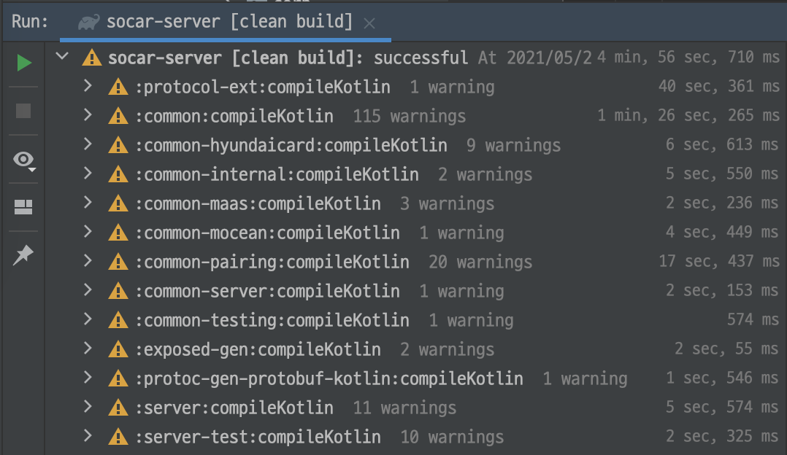
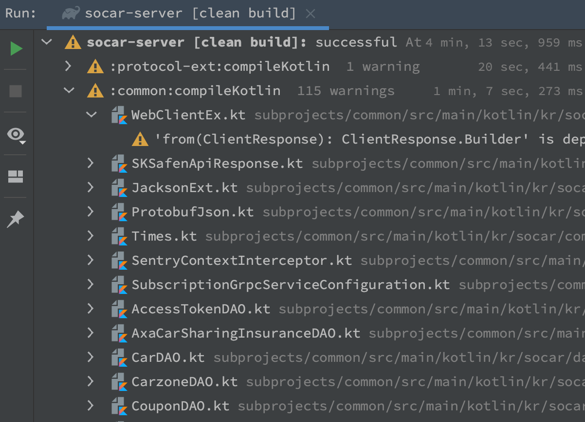
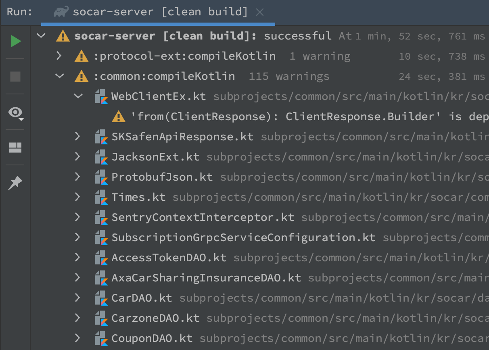

# 제목 : Apple M1 에서 쏘카 API 서버 돌려보기
## 부제 : 지원이 끊긴 라이브러리를 돌려보자


## 험난한 M1 입수

올해 초 쏘카로 이직을 하였습니다. ~~쏘린이...~~ 
쏘카는 입사시 장비를 선택할 수 있는데요, 평소 신상을 선호하는 성격이 있어 _용감하게?_ 출시된지 얼마되지 않은 Apple Silicon (이하 M1) 맥북이 너무 써보고 싶어 신청을 하게 되었습니다. 선택 사항으로 메모리를 16GB 로 올렸고, 개인적으로 영문자판을 선호하여 자판도 영문으로 선택하였습니다. ~~(이게 문제였어...)~~ M1 프로세서의 수급이 불안정하여 ~~아주아주아주아주아주아주아주아주~~ 긴 시간을 기다리게되었고, 그 ~~길고길고길고길고길고길고길고길고~~ 긴 시간 동안 임시 장비를 사용하다 M1 맥북을 받게 되었습니다.


## 으어...메이징한 M1 의 성능

지급받은 맥북은 사실 겉으로 보기에는 기존 맥북 프로와 큰 차이가 없습니다. 아, Thunderbolt 포트가 4개에서 2개로 줄었다는 것과 키보드가 가위식으로 바뀌었다는 것이 큰 차이군요. 디스플레이 해상도, 크기, 무게는 별 큰 차이가 없습니다. 심지어 facetime 카메라의 해상도도 동일합니다. ~별로 편리하지 않은~ 터치바도 동일하게 붙어 있습니다. 단, 키보드가 가위식으로 바뀌면서 *물리키 ESC* 가 추가되었습니다.

하지만 기존 intel CPU 기반의 맥북 프로 대비 엄청난 성능 향상이 있습니다.

옆자리 동료분의 맥북 프로는 15인치입니다. **거의 하루 종일 팬이 돌고 있죠**. 배터리는... 설명하지 않아도 아시리라 생각합니다. 회의 참석이 길어질 경우 어댑터부터 챙겨야합니다. 하지만 M1 은 평소에는 차갑습니다. ~~stackoverflow~~인터넷에서 뭔가 찾는 정도의 일상에서는 하판이 늘 차갑습니다. 빌드를 시작하면 체온~~저는 인간의 정상 체온을 유지합니다~~ 정도까지는 올라오는 것 같습니다... 그러다 아 좀 온도가 올라가는건가? 싶을 때 쯤 빌드가 끝납니다. 그리고 다시 빠르게 차가워지죠. 팬이 도는 걸 보기가 힘듭니다. 오죽하면 누군가가 _팬 소리를 되돌려 달라_ 며 팬 소음을 시뮬레이션해주는 App 도 만들어놨더군요. 배터리는 또 어찌나 오래가는지... 가끔 재택 근무 중 어댑터 연결을 깜빡하는데, 퇴근 시간 즈음에 배터리 알림이 떠서 그제야 연결해주기도 합니다.

말이 길군요. 자 그래서 그러면 도대체 성능이 얼마나 어메이징하길래...

역사상 가장 빠른 x86 맥이라는 찬사를 들었던 M1 입니다. 심지어 로제타2 를 통해서 x86 바이너리를 실행하는 성능도 기존의 맥북을 뛰어넘는다고 하죠.

우선 비교군으로, 제 옆자리 분의 15인치 맥북으로 빌드를 해보겠습니다.
<p align="center"><br>4분 56초 = 296초가 걸리는군요.</p

M1 의 성능 1 : 일단 로제타2로 쏘카 API 서버를 빌드해보겠습니다.
<p align="center"><br>4분 13초 = 253초 걸렸습니다. 13인치 + 로제타로 15인치급의 성능을 내는 것을 볼 수 있습니다.</p>
 

M1 의 성능 2 : M1 에 대응하는 JDK (aarch64) 로 쏘카 API 서버를 빌드해보겠습니다.
<p align="center"><br>1분 52초 = 112초 걸렸습니다.</p>

대략 2.6배 정도의 성능차이입니다. 다시 말씀드립니다만 **15인치 인텔** 맥북 vs **13인치 M1** 맥북입니다.

**_가격 차이요??? 훗..._**


## 그러나...

1. Docker 가 지원되지 않았습니다.
    - 쏘카는 Docker 와 K8s 로 서비스를 구성합니다. 그런데 Docker 가 지원이 안됩니다. 헉...


2. JDK 15 미만이 지원되지 않습니다.


3. 아키텍쳐 의존성이 있으나 지원이 끊어진 라이브러리가 대응되지 않습니다.
   - 테스트 케이스 수행을 위해 Redis 와 MySQL 을 띄워야 합니다. 
   - 그러나 이 라이브러리가 매우 오래되었고 git hub repo 기준으로도 더이상 유지 보수가 되고 있지 않았습니다.
   - protobuf 컴파일이 되지 않습니다.


## 안되면 뭐다...? 되게 한다...
하지만 장비는 이미 M1 으로 받았고, 소스는 빌드를 해야 하고... 그러니 ~~목마른 자가 우물을 파..~~ 제가 되도록 해야겠네요.  

### Docker
   하지만! 현재는 Docker 가 온전하게 M1 을 지원합니다. 당시에는 Technical Preview 를 사용했습니다. 지원이 안되는 부분이 있긴 했습니다만 프리뷰에서도 어느 정도 호환성이 확보되고 있는 시점이었어요.


### JDK
 현재 M1 대응 JDK 는, brew 를 통해서 설치하거나 Zulu 를 사용하면 됩니다. 다만 구버전의 JDK 는 안된다고 보셔야... 이건 제가 어떻게 할 수 있는 부분이 아니더군요. 새 버전을 씁시다. _(찡긋)_


### Wix MySQL / Embedded Redis

   해당 라이브러리 git repo 에 PR 이 많습니다만 관리되고 있지 않습니다. 반영해달라고 PR 보내도 아마 읽씹당할 것 같습니다. 무서우니까 우리가 해결하도록합니다.
   ~~이 글을 쓰고 있는 이유~~
   

   1. Wix MySQL 
      
      Wix MySQL 자체는 문제가 없습니다만, 해당 라이브러리가 사용하는 `de.flapdoodle.embed.process` 패키지가 문제가 됩니다.
      구형 2.1.3 버전을 쓰고 있군요. 버전을 올리면 Wix MySQL 이 깨지는 형편이라 해당 2.1.3 버전을 수정해야할 것 같습니다.
      
      해당되는 아키텍쳐 aarch64 를 지원하지 않아, 32bit legacy 를 시도하는 문제입니다. 우선 해당 라이브러리를 clone 받습니다. 
      그리고 문제가 되는 부분의 코드를 찾아 보면.. `BitSize.java` 파일입니다. 
      
      
      여기군요. (작성 시점으로 보니 뭔가 반영한 것 같습니다?? osArch.endsWith("64") 로 바뀌었군요!!)
      
      https://github.com/flapdoodle-oss/de.flapdoodle.embed.process/blob/6c8a0534ec73254d07caf9efbd691207d3547462/src/main/java/de/flapdoodle/embed/process/distribution/BitSize.java#L36
      
      ```
      if (osArch.equals("i686_64") || osArch.equals("x86_64") || osArch.equals("amd64"))
      ```

      M1 에 대응할 수 있도록 OS 코드를 심어줍시다. 엄밀하게는 aarch64 를 지원하도록 하는 겁니다. ~~사실 ppc64le 는 안해도 됩니다.~~
   
      ```
      if (osArch.equals("i686_64") || osArch.equals("x86_64") || osArch.equals("amd64") || osArch.equals("ppc64le") || osArch.equals("aarch64"))
      ```
      
   2. Embedded Redis
      
      이 쪽은 아키텍쳐와 바이너리 모두를 수정해줘야 합니다. 우선 `Architecture.java` 파일에 항목을 추가합니다.

      https://github.com/spinnaker/embedded-redis/blob/783bbdaeb7a6ef5e5644e1e09ca3bea6f48ab62d/src/main/java/redis/embedded/util/Architecture.java#L3

      ```
      public enum Architecture {
         x86,
         x86_64,
         APPLE_SILICON
      }
      ```

      그리고 `OsArchitecture.java` 파일에 해당 항목을 등록합니다.
      
      https://github.com/spinnaker/embedded-redis/blob/783bbdaeb7a6ef5e5644e1e09ca3bea6f48ab62d/src/main/java/redis/embedded/util/OsArchitecture.java#L13
      
      ```
      public static final OsArchitecture MAC_OS_APPLE_SILICON = new OsArchitecture(OS.MAC_OS_X, Architecture.APPLE_SILICON);
      ```
      그다음 `OSDetector.java` 를 열어봅시다.
      
      여기군요.
      
      https://github.com/spinnaker/embedded-redis/blob/783bbdaeb7a6ef5e5644e1e09ca3bea6f48ab62d/src/main/java/redis/embedded/util/OSDetector.java#L77
      
      ```
      private static Architecture getMacOSXArchitecture() {
         ...
      }
      ```
   
      기본 x86_64 를 리턴하는 부분에서 M1 에 대응할 수 있도록 OS 분기를 칩니다. 사용된 값들은 macOS 에서 제공하는 시스템 변수입니다.
      ```
      if (sysctl.containsKey("hw.cpu64bit_capable") && sysctl.get("hw.cpu64bit_capable").equals("1")) { // 64bit CPU
          if (sysctl.containsKey("hw.optional.arm64") && sysctl.get("hw.optional.arm64").equals("1")) {
              return Architecture.APPLE_SILICON;
          } else {
              return Architecture.x86_64;
          }
      }
      ```
   
      그리고 Redis Binary 를 추가합니다. 디폴트로 제공되는 4.x 버전은 M1 대응이 안되므로... 
      아쉽지만 6.2.1 버전을 추가합니다. 6.2.1 소스를 받아서 컴파일한 후에 resources 디렉토리 아래에 붙여넣습니다. 저는 postfix 로 -AS 를 사용했습니다. (Apple Silicon)
      이제 RedisExecProvider.java 에서 위의 실행파일을 사용하도록 합니다.
      
      https://github.com/spinnaker/embedded-redis/blob/783bbdaeb7a6ef5e5644e1e09ca3bea6f48ab62d/src/main/java/redis/embedded/RedisExecProvider.java#L26
      ```
       private void initExecutables() {
         ....
           executables.put(OsArchitecture.MAC_OS_APPLE_SILICON, "redis-server-6.2.1-AS.app");
       }
      ```

        해결된 두개의 라이브러리는 쏘카 private repo 에 등록하였습니다. 이후 동료들이 M1, M2(예정), 혹은 그 이후의 Apple Silicon 맥북을 사용하게 될 때 활용할 수 있겠지요.


  3. protobuf

     google 은 여기에 대응할 생각이 없는 것 같습니다. (아직은)
     그래서 protobuf 파일을 컴파일 할 때에는 로제타를 통해 이를 수행해야합니다. build 파일을 수정합니다. 강제로 x86_64 로 인식하도록 하면 됩니다.

     여기군요.
     ```
     protobuf {
       protoc {
           artifact = "com.google.protobuf:protoc:$protobufVersion"
       }
     }
     ```

     이렇게 수정해줍니다.
     ```
     protobuf {
         protoc {
             if (System.getProperty("os.arch") == "aarch64" &&
                 System.getProperty("os.name").toLowerCase().contains("mac") ) {
                 System.setProperty("os.arch", "x86_64")
             }
             artifact = "com.google.protobuf:protoc:$protobufVersion"
         }
     }
     ```

### 자 이제 빌드를 해봅니다.

스크롤을 위로 올려보면 짤방이 있습니다 _(찡긋)_


## 결론...
이런 과정을 거치면 M1 에서도 문제없이 쏘카 API 서버를 돌릴 수 있게 됩니다.

쉽죠? 이래도 M1 맥북 안쓰실거에요? 아... M1x/M2 기다리시는구나.. 네.. 

